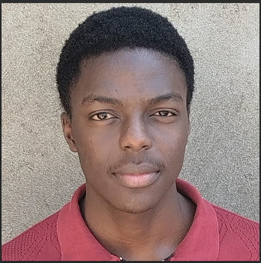
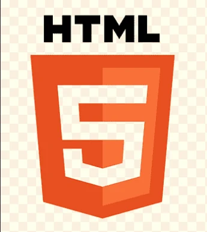
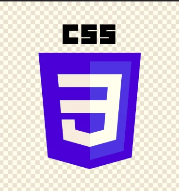
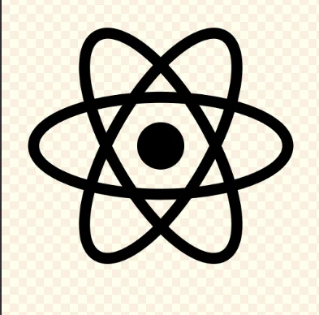
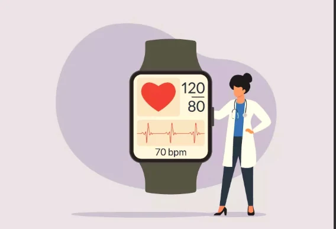
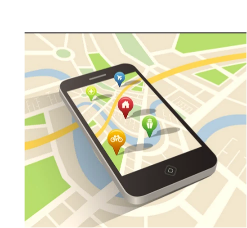
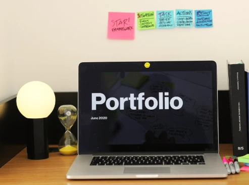
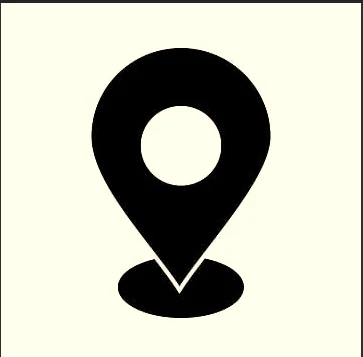

<!DOCTYPE html>
<html lang="en">

<head>
    <meta charset="UTF-8">
    <meta http-equiv="X-UA-Compatible" content="IE=edge">
    <meta name="viewport" content="width=device-width, initial-scale=1.0">
    <title>My Portfolio</title>
    <link rel="stylesheet" href="style.css">
    
</head>

<body>
    <header>
        <h1>Welcome to My Portfolio</h1>
        <nav>
            
            <ul>
                <li><a href="#about">About Me</a></li>
                <li><a href="#projects">Projects</a></li>
                <li><a href="#services">Services</a></li>
                <li><a href="#contact">Contact</a></li>
            </ul>
        </nav>
    </header>

   <main>
        

            <h3>HELLO I'M WISELY MOKUA</h3>
            
An aspiring web developer with a passion for creating beautiful and functional websites.

        

        

            

                <h2>About Me</h2>
                
I am an undergraduate student at KCA University persuing a degree in Software Development.I stay in
                    Nairobi,Kenya where I develop my skills and knowledge in web development by taking part time gigs in
                    cyber cafes.

            

        

        

            

                <h2>Skills</h2>
                <ul class="skills-list">
                    <li>HTML</li>
                    <li>CSS</li>
                    <li>JavaScript</li>
                    <li>React</li>
                    <li>GitHub</li>
                    <li>VS Code</li>
                    <li>MongoDB</li>
                </ul>
            

    

        

            

                <h2>Projects</h2>
                
Here are a few examples of the work I am doing done.

                <ul class="project-gallery">
                    <li>
                        <button class="project-card" type="button" data-title="Exercise"
                            data-description="A project focused on exercise and fitness." data-image="Work/Exercise.webp"
                            aria-haspopup="dialog">
                            
                            <strong>Exercise</strong>
                            A project focused on exercise and fitness.
                            View details
                        </button>
                    </li>
                    <li>
                        <button class="project-card" type="button" data-title="Food Delivery"
                            data-description="A project exploring a food delivery experience."
                            data-image="Work/Food%20Delivery.webp" aria-haspopup="dialog">
                            
                            <strong>Food Delivery</strong>
                            A project exploring a food delivery experience.
                            View details
                        </button>
                    </li>
                    <li>
                        <button class="project-card" type="button" data-title="Maps"
                            data-description="A project focused on maps and location information."
                            data-image="Work/Maps.webp" aria-haspopup="dialog">
                            
                            <strong>Maps</strong>
                            A project focused on maps and location information.
                            View details
                        </button>
                    </li>
                    <li>
                        <button class="project-card" type="button" data-title="My Portfolio"
                            data-description="A project showcasing my skills and experience."
                            data-image="Work/Portfolio.webp" data-github="https://github.com/wiselymokua/walk"
                            aria-haspopup="dialog">
                            
                            <strong>My Portfolio</strong>
                            A project showcasing my skills and experience.
                            View details
                        </button>
                    </li>
                </ul>
                <dialog class="project-dialog" id="project-dialog" aria-labelledby="project-dialog-title">
                    

                        <h3 id="project-dialog-title"></h3>
                        <button class="project-dialog-close" type="button">Close</button>
                    

                    
                    

                    
<strong>Technology used for development:</strong> HTML, CSS and JavaScript.

                    
<strong>Status:</strong> Still Under Development. Coming soon.

                    <a id="project-dialog-github" href="" target="_blank" rel="noopener noreferrer" hidden>View this
                        project on GitHub</a>
                </dialog>
            

        

        

            

                <h2>Services</h2>
                <ul class="service-list">
                    <li>
                        
                        <h3>Basic Website Development</h3>
                        
Building websites with HTML, CSS, JavaScript, and React.

                    </li>
                    <li>
                        
                        <h3>Basic Responsive Web Design</h3>
                        
Creating layouts that adapt to phones, tablets, and desktop screens.

                    </li>
                    <li>
                        
                        <h3>Basic Website Updates</h3>
                        
Improving the content, layout, and styling of existing web pages.

                    </li>
                </ul>
            

        

        

            

                <h2>GitHub</h2>
                

                    
Loading GitHub profile…

                

                <ul id="github-repos" class="github-repos" aria-live="polite"></ul>
            

        

        

            

                

                    <h2>Contact Me</h2>
                    
If you would like to get in touch with me reach out to me via
                        email or social media.

                    <ul class="contact-details">
                        <li><a href="tel:+254727817470">072
                                781 7470</a></li>
                        <li><a
                                href="https://mail.google.com/mail/?view=cm&amp;fs=1&amp;to=mokuawisely83%40gmail.com"
                                target="_blank" rel="noopener noreferrer">mokuawisely83@gmail.com</a></li>
                        <li><a
                                href="https://www.linkedin.com/in/wisely-mokua-b836ab419" target="_blank"
                                rel="noopener noreferrer">LinkedIn</a></li>
                        <li><a href="https://github.com/wiselymokua"
                                target="_blank" rel="noopener noreferrer">GitHub</a></li>
                        <li>Nairobi, Kenya
                        </li>
                    </ul>
                

            

        

    </main>
</body>

</html>
